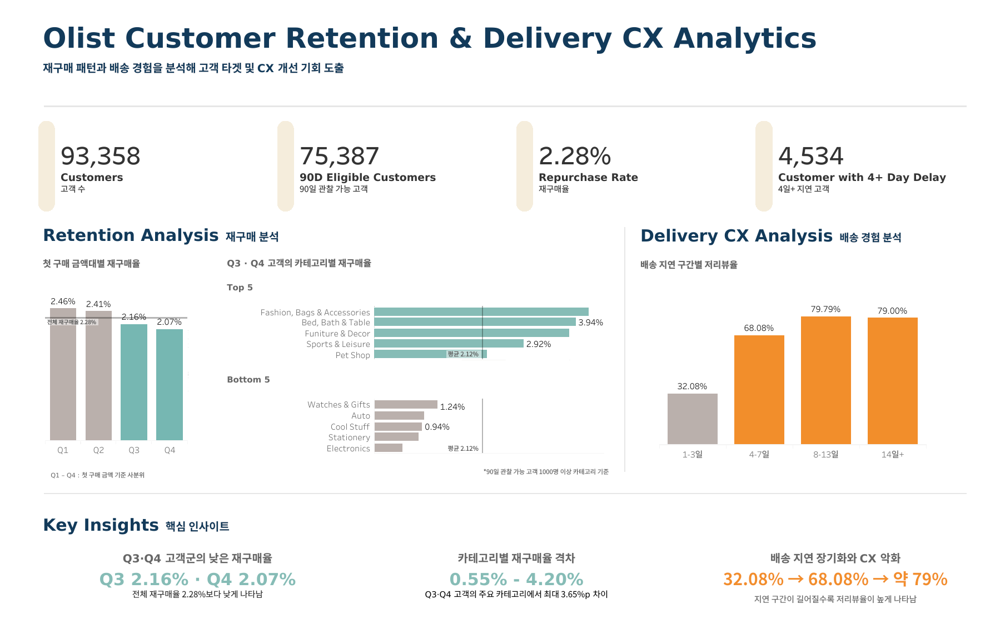

# Olist Customer Retention & Delivery CX Analytics

Olist 공개 이커머스 주문 데이터를 기반으로 고객의 **재구매 패턴과 배송 경험**을 분석한 데이터 분석 프로젝트입니다.

SQL로 주문·고객 단위 데이터마트를 구축해 리텐션과 배송 CX 관련 패턴을 분석하고, 주요 후보 요인은 Python 로지스틱 회귀로 추가 검증했습니다.

분석 결과는 **비즈니스 타깃 정의, 후속 A/B 테스트 설계, Tableau 대시보드**로 연결했습니다.

**SQL · PostgreSQL · Python · Tableau**

---

## Project Overview

고객의 첫 구매 이후 재구매 패턴과 주문·배송 경험을 중심으로 분석했습니다.

분석은 **데이터 검증 → 데이터마트 구축 → 리텐션·CX 분석 → 통계적 추가 검증 → 비즈니스 타깃 정의 → A/B 테스트 설계 → 시각화** 순으로 진행했습니다.

### Project Snapshot

| Metric | Result |
| --- | ---: |
| 전체 고객 | 93,358 |
| 90일 관찰 가능 고객 | 75,387 |
| 90일 내 재구매 고객 | 1,716 |
| 90일 재구매율 | 2.28% |
| 4일 이상 배송 지연 고객 | 4,534 |

90일 재구매율은 첫 구매 이후 **최소 90일의 관찰 기간이 확보된 고객**만을 분모에 포함해 계산했습니다.

---

## Dashboard

[View Interactive Dashboard on Tableau Public](https://public.tableau.com/views/Olisttableau_17890359173800/1?:language=ko-KR&:sid=&:redirect=auth&:display_count=n&:origin=viz_share_link)

---

## Key Insights

### 1. 첫 구매 결제금액 상위 50%(Q3·Q4)의 낮은 재구매율

**Q1 2.46% · Q2 2.41% · Q3 2.16% · Q4 2.07%**

첫 구매 결제금액을 고객 기준 사분위로 구분했을 때,  
Q3·Q4 고객의 90일 재구매율은 **2.12%**로 전체 고객의 2.28%보다 낮았습니다.

카테고리와 첫 구매 코호트를 함께 고려한 로지스틱 회귀에서도  
Q3·Q4 고객의 재구매 odds가 낮은 방향으로 유지되어 후속 리텐션 실험의 타깃 후보로 활용했습니다.

---

### 2. Q3·Q4 고객 내부에서도 카테고리별 재구매율 차이 존재

**90일 재구매율 0.55% ~ 4.20%**

Q3·Q4 고객 중 90일 관찰 가능 고객이 1,000명 이상인 카테고리를 비교한 결과,  
카테고리별 90일 재구매율은 **0.55%에서 4.20%**까지 차이가 나타났습니다.

이에 따라 카테고리를 독립적인 타깃 선정 기준으로 사용하기보다,  
**메시지 개인화와 실험 결과 해석을 위한 맥락 변수**로 활용했습니다.

---

### 3. 배송 지연 장기화와 CX 악화

**4일 이상 지연 고객 저리뷰율 75.02% · 1~3일 지연 대비 저리뷰 odds 약 6.1배**

배송 지연이 길어진 고객군에서 저리뷰율이 높은 수준으로 관찰됐습니다.

특히 4일 이상 배송 지연 고객의 저리뷰율은 **75.02%**였으며,  
다른 관측 특성을 함께 고려한 로지스틱 회귀에서도  
1~3일 지연 고객 대비 저리뷰 odds가 약 **6.1배** 높게 나타났습니다.

> 배송 지연 4일은 통계적 변화점이 아니라 분석 구간 구분과 운영 활용을 위해 설정한 기준입니다.

---

## Analysis Process

### 1. Data Validation & Mart

중복, 결측치, 날짜 순서와 조인 구조를 검증한 뒤  
**주문 1건 = 1행**, **고객 1명 = 1행** 기준의 분석용 데이터마트를 구축했습니다.

→ [`01_data_validation.sql`](sql/01_data_validation.sql)  
→ [`02_order_level_mart.sql`](sql/02_order_level_mart.sql)  
→ [`03_customer_behavior_mart.sql`](sql/03_customer_behavior_mart.sql)

### 2. Retention & Order Lifecycle

주문 생성부터 배송 완료까지의 주문 처리 흐름을 확인하고,  
첫 구매를 기준으로 코호트와 30·60·90일 재구매 지표를 구성했습니다.

→ [`04_order_lifecycle_analysis.sql`](sql/04_order_lifecycle_analysis.sql)  
→ [`05_cohort_retention.sql`](sql/05_cohort_retention.sql)

### 3. Repurchase & Delivery CX Analysis

첫 구매 결제금액, 카테고리, 배송 지연, 리뷰와 재구매의 관계를 비교했습니다.

일부 고객은 첫 주문의 배송 경험이 완료되기 전에 다음 주문을 생성한 경우가 있어,  
배송 경험과 재구매 간 관계는 **인과관계로 해석하지 않았습니다.**

→ [`06_repurchase_driver_analysis.sql`](sql/06_repurchase_driver_analysis.sql)

### 4. Statistical Validation

SQL에서 탐색한 재구매 및 CX 관련 후보 요인이  
다른 관측 특성을 함께 고려한 뒤에도 연관성이 유지되는지 Python 로지스틱 회귀로 추가 확인했습니다.

이 분석은 예측 모델 구축이 아니라 **후보 요인과 결과 변수 간 조정된 연관성을 확인하는 목적**으로 수행했습니다.

→ [`01_repurchase_driver_validation.ipynb`](notebooks/01_repurchase_driver_validation.ipynb)

### 5. Business Target & Experiment Design

분석 결과를 바탕으로 Retention/CX 대상군을 정의하고,  
각 고객군의 규모와 baseline을 기준으로 후속 A/B 테스트의 표본 규모와 detectable effect를 계산했습니다.

→ [`07_business_action_targets.sql`](sql/07_business_action_targets.sql)  
→ [`02_ab_test_design.ipynb`](notebooks/02_ab_test_design.ipynb)

### 6. Tableau Visualization

최종 분석 결과와 주요 지표를 한 화면에서 확인할 수 있도록 Tableau 대시보드를 구성했습니다.

---

## Experiment Design

분석 결과를 기반으로 후속 실험 대상군을 다음과 같이 정의했습니다.

- **Retention Target** — 첫 구매 결제금액 상위 50%(Q3·Q4) 고객
- **Delivery CX Target** — 4일 이상 배송 지연 고객

각 타깃군의 고객 수와 baseline을 기준으로  
후속 A/B 테스트에 필요한 **표본 규모와 detectable effect**를 계산했습니다.

이 단계의 목적은 분석 결과를 실제 의사결정으로 연결할 수 있는  
**후속 실험 구조를 사전에 설계하는 것**입니다.

Olist 데이터에는 실제 treatment/control 정보가 존재하지 않기 때문에  
**실험을 실행하거나 treatment effect를 측정한 것은 아닙니다.**

따라서 본 프로젝트에서는 **타깃 정의와 A/B 테스트 설계까지만 수행했습니다.**

---

## Tech Stack

| Area | Tools |
| --- | --- |
| Database | PostgreSQL |
| SQL Environment | DBeaver |
| Analysis | SQL, Python |
| Statistical Analysis | Logistic Regression |
| Visualization | Tableau Public |
| Version Control & Documentation | GitHub |

---

## Limitations

- 공개된 과거 주문 데이터를 활용한 관찰 분석으로, 변수 간 관계를 인과관계로 해석하지 않았습니다.

- 최근 고객은 90일의 충분한 관찰 기간을 확보할 수 없어 90일 재구매율 계산에서 별도로 처리했습니다.
- 일부 고객은 첫 주문 배송 완료 전에 다음 주문을 생성해 배송 경험과 재구매 간 명확한 시간적 선후관계가 성립하지 않았습니다.
- 배송 지연의 4일 기준은 통계적 변화점이 아니라 분석 구간 구분과 운영 활용을 위한 기준입니다.
- 상품 카테고리의 원본 결측 및 영문 번역 누락 값은 `unknown_category`로 처리했습니다.
- 실제 A/B 테스트 데이터가 없어 실험 효과를 측정하지 않았으며, 후속 실험 설계까지만 수행했습니다.

---

## Documentation

- [Data Modeling](docs/data_modeling.md) — 원본 데이터 구조, 테이블 간 관계와 데이터 모델링 기준
- [Progress Log](docs/progress_log.md) — 분석 단계별 진행 내용, 주요 검증과 의사결정 기록