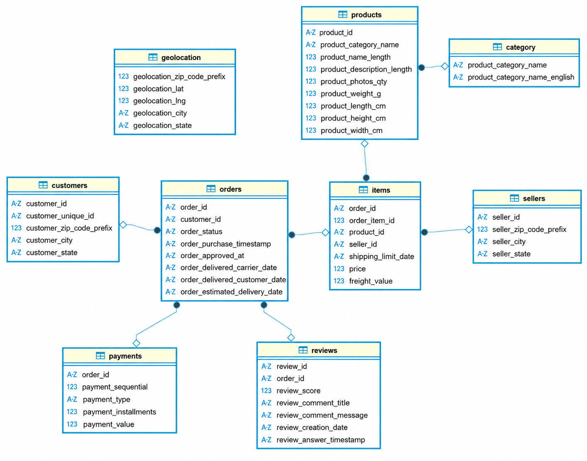

# 데이터 모델링

## 1. 개요

Olist 이커머스 데이터셋의 구조를 이해하고 이후 분석에 활용하기 위해 테이블 간 관계를 확인하고 ERD(Entity Relationship Diagram)를 작성하였다.

원본 데이터는 CSV 형태로 제공되어 데이터베이스에 실제 Primary Key(PK)와 Foreign Key(FK) 제약조건이 설정되어 있지 않았다. 따라서 각 컬럼의 고유성과 테이블 간 연결 구조를 기준으로 논리적인 데이터 모델을 구성하였다.

분석 환경에서는 테이블명을 간결하게 사용하기 위해 원본의 `order_items`, `order_payments`를 각각 `items`, `payments`로 변경하였다.

---

## 2. 테이블 간 관계

분석에 활용한 주요 테이블 관계는 다음과 같다.

| 부모 테이블 | 자식 테이블 | 연결 컬럼 |
|---|---|---|
| customers | orders | customer_id |
| orders | items | order_id |
| orders | payments | order_id |
| orders | reviews | order_id |
| products | items | product_id |
| sellers | items | seller_id |
| category | products | product_category_name |

---

## 3. 논리적 기본키

원본 데이터에는 PK 제약조건이 존재하지 않으므로, 데이터의 고유성을 기준으로 다음 컬럼을 논리적 기본키로 판단하였다.

| 테이블 | 논리적 기본키 |
|---|---|
| customers | customer_id |
| orders | order_id |
| products | product_id |
| sellers | seller_id |
| category | product_category_name |
| items | (`order_id`, `order_item_id`) |
| payments | (`order_id`, `payment_sequential`) |

`reviews`와 `geolocation` 테이블은 원본 데이터만으로 신뢰할 수 있는 단일 기본키를 확인하기 어려워 별도의 기본키를 지정하지 않았다.

---

## 4. 모델링 기준

- 원본 데이터의 구조를 유지하기 위해 실제 PK/FK 제약조건은 추가하지 않았다.
- DBeaver의 Virtual Key와 가상 관계 기능을 이용해 논리적 관계를 표현하였다.
- `geolocation` 테이블의 `geolocation_zip_code_prefix` 값은 중복되므로 단일 기본키로 사용할 수 없다고 판단하였다.
- `geolocation` 테이블은 현재 ERD에서 직접 연결하지 않고, 추후 지역 분석 시 별도 정제 또는 집계 후 활용할 예정이다.

---

## 5. ERD

